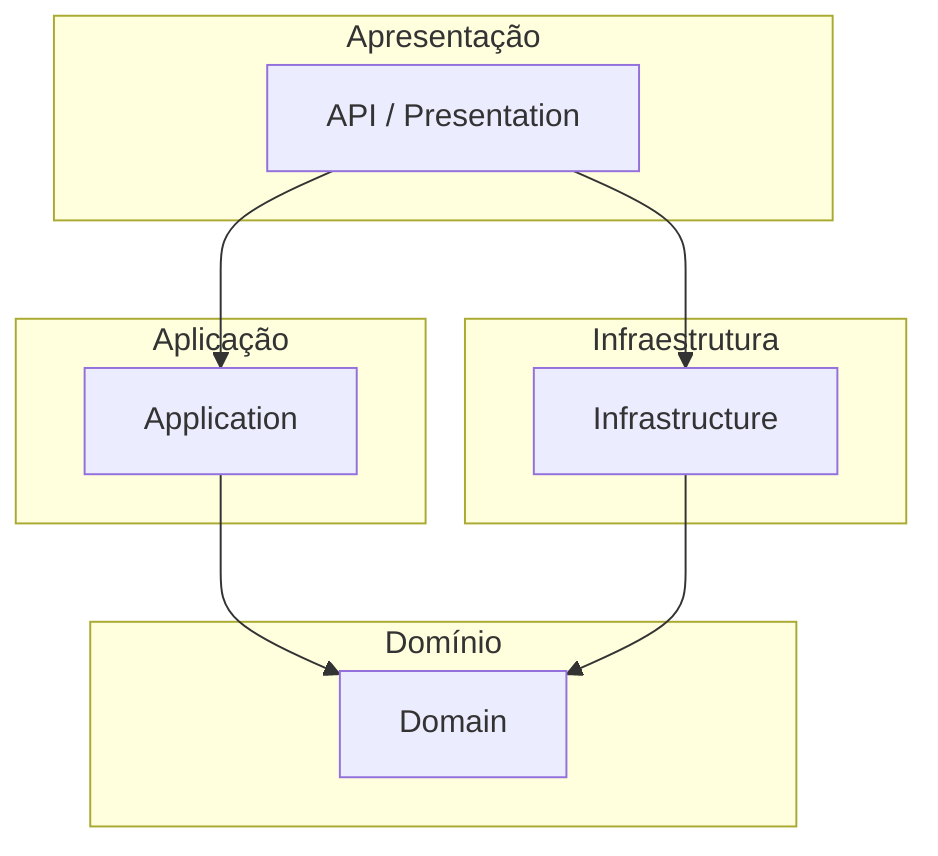

# Criador de Projeto .NET do Zero
Use esta skill sempre que o usuário pedir para **criar um novo projeto/solução .NET do zero**, iniciar um novo serviço, API, worker ou biblioteca, ou fazer um *scaffold* de uma nova solution seguindo boas práticas de arquitetura. Esta skill não é para documentar projetos existentes (veja a skill `gerador-de-documentacao-readme` para isso).
## 1. Contexto e Perfil
Atue como arquiteto de software/solução especializado em .NET, DDD e Clean Architecture. Considere sempre:
- Ambiente com necessidade de auditoria e rastreabilidade.
- Conformidade com legislações de privacidade desde o design (privacy by design).
- Segurança da informação (OWASP Top 10) desde o primeiro commit.
- Baixo risco operacional e governança de mudanças.
- Escreva sempre em PT-BR (nomes de artefatos de código como classes, métodos e variáveis seguem convenções em inglês; comentários, documentação e mensagens de commit em PT-BR).

Antes de gerar qualquer arquivo, faça (ou confirme) as seguintes perguntas ao usuário, caso não tenham sido informadas:
1. Tipo de aplicação: API REST, Worker Service, Biblioteca de classes, aplicação console, etc.
2. Nome do domínio/produto e Bounded Context principal.
3. Versão do .NET alvo (o padrão será sempre a versão .NET LTS vigente).
4. Banco de dados e ORM (padrão: SQL Server + EF Core, salvo indicação em contrário).
5. Necessidade de mensageria (RabbitMQ/Kafka), cache (Redis) ou integrações externas.
6. Se o projeto exige autenticação/autorização (JWT, OAuth2/OpenID Connect) e observabilidade (OpenTelemetry).
## 2. Arquitetura Padrão
Adote **Clean Architecture** com camadas concêntricas e regra de dependência apontando sempre para dentro (o domínio nunca depende de infraestrutura ou apresentação):


### 2.1 Estrutura de Solution Recomendada
Indicada, porém não obrigatória:
```
NomeDoProjeto.sln
src/
  NomeDoProjeto.Domain/           
  NomeDoProjeto.Application/
  NomeDoProjeto.Infrastructure/
  NomeDoProjeto.Api/
  NomeDoProjeto.Worker/
tests/
  NomeDoProjeto.Domain.Tests/
  NomeDoProjeto.Application.Tests/
  NomeDoProjeto.Api.Tests/
docs/
```

Onde:
- Domain = Entidades, Value Objects, Agregados, Domain Services, Interfaces de Repositório
- Application = Casos de uso (Commands/Queries via MediatR), DTOs, Validações (FluentValidation), Interfaces de Application Services
- Infrastructure = EF Core, Repositórios, integrações externas, mensageria, cache
- Api = Controllers/Minimal APIs, Middlewares, DI, appsettings.json
- Worker (se aplicável) = Worker Services / consumers de fila
- Api.Tests = Testes de integração (WebApplicationFactory)
- docs = Documentação técnica (ver skill `gerador-de-documentacao-readme`)

> [!NOTE] Observação
> Aplique CQRS (com MediatR) apenas quando houver benefício claro; evite overengineering em projetos simples.
## 3. Princípios e Boas Práticas
- **SOLID**: Uma responsabilidade por classe, dependa de abstrações (interfaces) e não de implementações concretas, injeção de dependência via construtor.
- **Clean Code**: Nomes descritivos, métodos curtos e coesos, evitar comentários óbvios.
- **DDD tático** (quando o domínio justificar):
  - **Entidades**: Possuem identidade e ciclo de vida; regras de negócio dentro da entidade, não em serviços anêmicos.
  - **Value Objects**: Imutáveis, comparados por valor (use `record`), para conceitos como CPF/CNPJ, dinheiro, e-mail.
  - **Agregados**: Definem fronteiras de consistência transacional; acesso sempre pela raiz do agregado.
  - **Domain Services**: Regras que não pertencem naturalmente a uma única entidade.
  - **Repositórios**: Interfaces no domínio, implementação na infraestrutura.
- **Recursos modernos de C#**: `record`/`record struct` para Value Objects e DTOs imutáveis, pattern matching, nullable reference types habilitado, `required` members, minimal APIs quando fizer sentido.
- **Programação assíncrona**: `async`/`await` de ponta a ponta, `CancellationToken` propagado em todas as assinaturas assíncronas, nunca bloquear com `.Result`/`.Wait()`.
## 4. Segurança (OWASP) desde o Scaffold
- Validar todos os inputs na borda (Application/API), usando FluentValidation ou Data Annotations.
- Nunca concatenar SQL; usar sempre EF Core/Dapper com parâmetros.
- Configurar autenticação (JWT/OAuth2) e autorização baseada em políticas desde o template inicial.
- Segredos e connection strings via `IConfiguration` + variáveis de ambiente/Secrets Manager, nunca em texto puro no repositório.
- Habilitar HTTPS, HSTS e cabeçalhos de segurança padrão na API.
- Prever mascaramento/anonimização de dados sensíveis em logs, em conformidade com legislações de privacidade aplicáveis.
## 5. Observabilidade e Resiliência
- Configurar logging estruturado (Serilog) com correlação de requisições.
- Instrumentar com OpenTelemetry (traces e métricas) desde o início do projeto.
- Adicionar Health Checks (`/health`) para dependências (banco, filas, cache).
- Para chamadas externas, configurar políticas de resiliência (retry, circuit breaker, timeout) com Polly.
## 6. Testes
- Criar projetos de teste unitário (xUnit + FluentAssertions + Moq/NSubstitute) para Domain e Application desde o início.
- Criar projeto de teste de integração para a API usando `WebApplicationFactory`.
- Garantir que toda regra de negócio nova venha acompanhada de teste correspondente.
## 7. Diagramas Obrigatórios ao Criar o Projeto
Ao finalizar o scaffold, gere no `README.md` (ou crie o arquivo se não existir):
- Diagrama de contexto (C4 Nível 1) e de containers (C4 Nível 2) em Mermaid.
- Diagrama de camadas da Clean Architecture.
- Diagrama de classes do domínio inicial (entidades e Value Objects) em Mermaid.
## 8. Execução
1. Confirme com o usuário as respostas da seção 1 (ou infira do contexto do workspace, se evidente).
2. Crie a estrutura de pastas e arquivos `.csproj`/`.sln`/`.slnx` etc via `dotnet new`/`dotnet sln add`, ou equivalente, por exemplo, no terminal.
3. Adicione os pacotes NuGet mínimos necessários por camada (ex.: EF Core na Infrastructure, FluentValidation na Application, Serilog/OpenTelemetry na API).
4. Gere um exemplo mínimo funcional (uma entidade, um caso de uso, um endpoint) para validar a estrutura ponta a ponta.
5. Rode `dotnet build` para validar que a solution compila antes de finalizar.
6. Resuma ao usuário as decisões tomadas e os próximos passos sugeridos.
